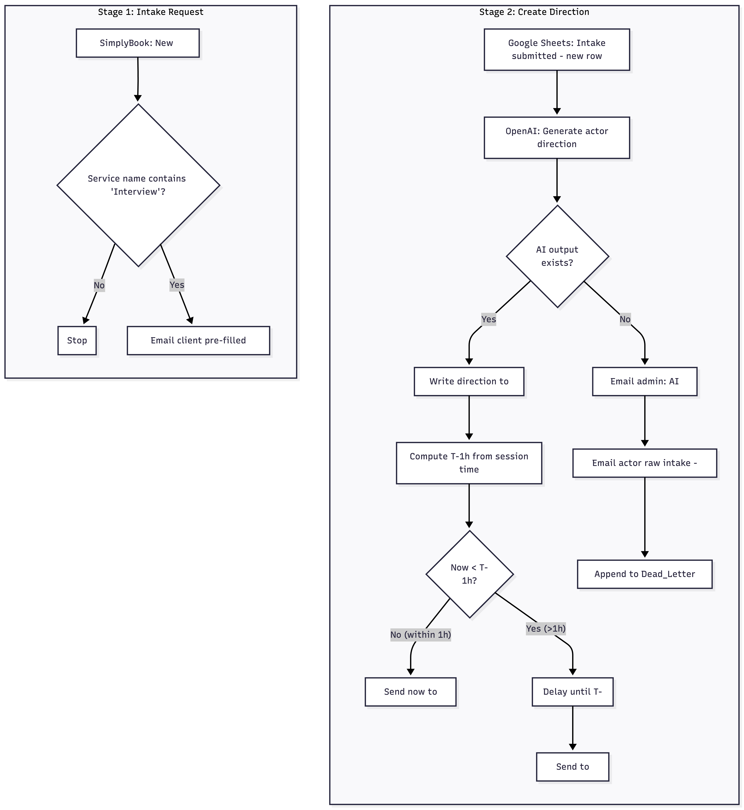

# Create-Direction-From-Intake-Zapier-OpenAI
Booking → Intake → AI service brief automation (Zapier + OpenAI) with T-60 delivery, fallback, and dead-letter logging.

# Mock-Interview Direction Generator (Zapier + OpenAI)

**TL;DR**  
When a client books, they receive a pre-filled intake form (hidden fields carry booking metadata). On submission, an LLM compiles a clean, custom-tailored brief that’s delivered to the service provider **~1 hour before the session** (or immediately if the intake arrives late). There’s a failure path that alerts admin, sends the service provider the raw intake as a fallback, and logs to a dead-letter sheet.

## Reference Files

**Demo (90s Loom):** [LOOM_LINK]  

**Prompt & Samples**

[System prompt (template)](prompt/system_prompt.template.txt)
[System prompt (filled sample)](prompt/system_prompt.sample_filled.txt)
[Service brief (sample AI output)](samples/openAI_output.sample.txt)

**Screenshots**

[Stage 1 screenshot](exports/stage1.png)
[Stage 2 screenshot](exports/stage2.png)

---

## Problem
Intermediaries were spending ~1 hour per session prepping service direction from scratch (chasing details, writing notes). We needed a repeatable, low-touch way to collect context from the client and deliver a standardized brief to the service provider, without manual ops.

## Solution — two simple automations

**Stage 1 — Intake request**  
Trigger on new booking (SimplyBook). Filter for the relevant service-type and email the client a **pre-filled intake** link (hidden fields carry booking metadata).

**Stage 2 — Direction generation & delivery**  
Trigger on intake submission (Google Sheets). Generate the actor brief (OpenAI), write it back to the sheet, and either **send now** (if < 1 hr to start) or **delay** so it lands **T-60m**. If the AI step fails, email **admin**, email the **actor the raw intake** as a fallback, and append to a **Dead_Letter** sheet.

---

## Flow diagram

## Stack

Automation: Zapier (Filter, Paths, Formatter, Delay, Email)

Data / triggers: SimplyBook → Google Sheets

AI: OpenAI (chat completions, system prompt enforces mappings/format)

Notifications: Email (actor/admin). Slack is trivial to add later.

## Prompt (system)

The OpenAI step uses a strict, sectioned system prompt that enforces:

Seven output blocks (Session/Coaching, Interviewer Direction, Company/Role, Resume, Sliders + Actions, 20-question set, Notes)

Canonical labels, spacing rules, slider math (0–100 → 1–5), and validations (e.g., include “Ask for measurable results 5×+” when metrics==Practice!)

Guardrails for missing inputs and off-limits topics

See the full text: prompt/system_prompt.txt

## Inputs & outputs

**Inputs**

From booking (Stage 1): client/provider emails, service name, session start + TZ, booking code → embedded as hidden/pre-filled intake fields.
From intake (Stage 2): goals, session_format, coaching_opt_in, five sliders (0–100), behavior toggles (Practice!/Neutral/Avoid), off_limits, resume_text, job_description, plus booking metadata.

**Outputs**

Client email with the pre-filled intake link (Stage 1)

Actor email with the LLM-generated direction, delivered T-60m or immediately if < 60m (Stage 2)

Sheet updates storing the brief on the intake row

Dead-letter row on failure (timestamp, booking_code, error, notes)

## Reliability, security & ops

Access & secrets. Platform-stored connections; no keys in plain text. Service account with least-privilege scopes.

Timing. Formatter computes T-60; branch to send-now vs delay so delivery lands at the right moment.

Failure handling. If the AI output is empty, Path B:

Email admin (flags booking and context)

Email actor the raw intake as a fallback so the session isn’t blocked

Append a row to Dead_Letter

Logging. Intake sheet stores the generated brief; Dead_Letter captures failures.

Catalog. Tracked in Automation_Catalog (name, owner, docs, Loom, related Zaps, last review).

Deliverability (demo note). Email by Zapier is used for this demo; production will switch to a domain-authenticated sender (GSuite/Outlook or SMTP/SendGrid with DKIM/SPF).

Privacy (planned). Prefilled intake URLs will be tokenized so PII isn’t exposed in query params.

Idempotency (planned). Gate by booking_code (sheet flag or Storage by Zapier) to skip duplicate sends.

## Result (representative run)

Client books → instantly receives intake link; completes it.

Stage 2 generates a structured brief and stores it on the row.

If > 60 minutes to start, email is scheduled for T-60m; otherwise it sends immediately.

A forced failure shows admin notified, actor received raw intake, and a Dead_Letter entry was created.

## Future ideas

Swap sender to domain-authenticated email; add Slack alerts on failure.

Tokenize intake URLs; add a short-lived one-time code.

Add a tiny JSON “sidecar” to validate sliders/actions before send.

Port to n8n/Make with environment secrets and retry/backoff policies.

Track metrics: on-time delivery %, error rate < 1%, hours saved/session.

© Jorgan Thibodeau, MIT License.

